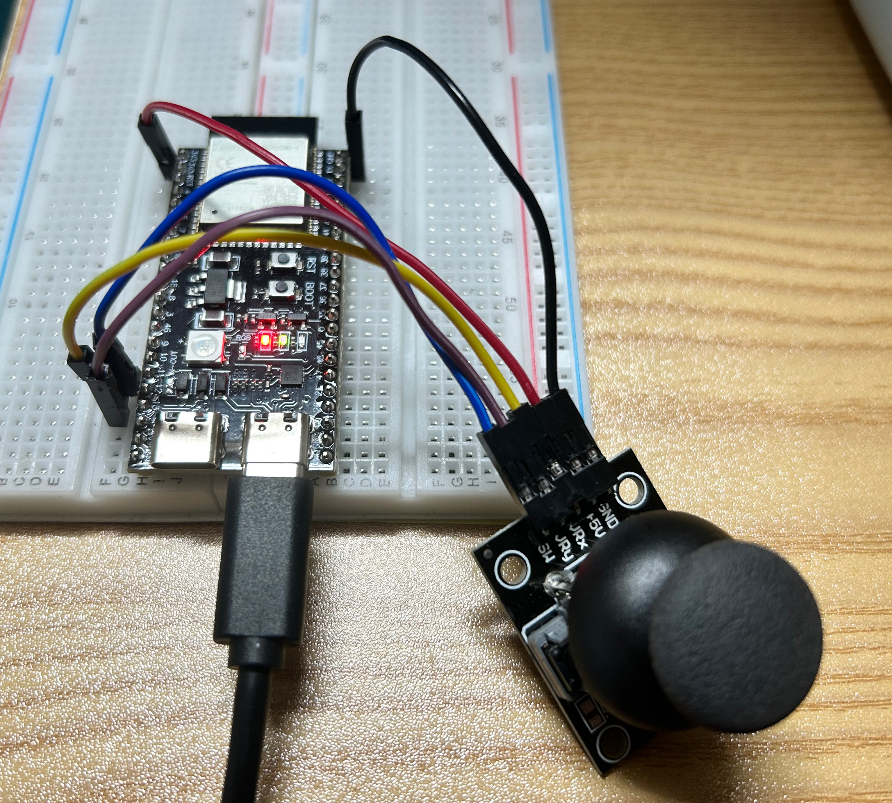

# ESP32-S3 Joystick Library

A joystick module library for ESP32-S3 board.

## 📸 Image

### Hardware Connection Image


## 📋 System Requirements

- **Board**: ESP32-S3
- **Joystick Module**: HW-504
- **Firmware**: MicroPython v1.26.1
- **Firmware File**: `ESP32_GENERIC_S3-20250911-v1.26.1.bin`

## 📌 Hardware Connection

```
HW-504 Joystick    ESP32-S3
VCC              -> 3.3V
GND              -> GND
VRX              -> GPIO12
VRY              -> GPIO13
SW               -> GPIO11
```

## 🚀 Quick Start

### 1. Firmware Installation
Install MicroPython firmware on ESP32-S3:
- Firmware file: `ESP32_GENERIC_S3-20250911-v1.26.1.bin`
- Installation tool: esptool.py or ESP32 Flash Tool

### 2. Library Upload
Upload `joystick.py` file to ESP32-S3.

### 3. Basic Usage
```python
from joystick import Joystick

# Create joystick object
joy = Joystick()

# Read values
x, y, button = joy.read()
print(f"X: {x:.2f}, Y: {y:.2f}, Button: {button}")
```

## 📋 Main Methods

| Method | Description | Return Value |
|--------|-------------|--------------|
| `read()` | Read normalized values | (-1.0 ~ 1.0, -1.0 ~ 1.0, True/False) |
| `read_raw()` | Read raw ADC values | (0 ~ 4095, 0 ~ 4095, 0/1) |
| `read_direction()` | 8-direction string | ("Center", "Up", "Right" etc.) |
| `read_angle_magnitude()` | Angle and magnitude | (0 ~ 360°, 0.0 ~ 1.0) |
| `read_values_string()` | String format | "x, y, button" |

## 💡 Usage Examples

### Basic Reading
```python
from joystick import Joystick

joy = Joystick()

while True:
    x, y, button = joy.read()
    print(f"X: {x:.2f}, Y: {y:.2f}, Button: {button}")
```

### Direction Check
```python
direction, button = joy.read_direction()
if direction == "Right":
    print("Move to the right")
elif direction == "Up":
    print("Move up")
```

### Raw Value Reading
```python
x_raw, y_raw, button = joy.read_raw()
print(f"Raw values: X={x_raw}, Y={y_raw}")
```

## 🔧 Configuration Options

### Deadzone Setting
```python
joy.set_deadzone(200)  # Default: 100
```

### Manual Calibration
```python
joy.calibrate()
```

## 🎮 Joystick Directions

```
            Up(Up)
             |
Left(Left) --+-- Right(Right)
             |
           Down(Down)
```

- **Center**: (0, 0)
- **Right**: (1, 0)
- **Left**: (-1, 0)
- **Up**: (0, 1)
- **Down**: (0, -1)

## 🔍 Troubleshooting

### Joystick Not Working
1. Check power connection (VCC -> 3.3V, GND -> GND)
2. Check pin connections (VRX->GPIO12, VRY->GPIO13, SW->GPIO11)
3. Check connection status: `joy.check_connections()`

### Abnormal Values
1. Place joystick in center and run `joy.calibrate()`
2. Adjust deadzone: `joy.set_deadzone(value)`

## 📊 ADC Channel Information

- **ADC1**: GPIO1~GPIO10 (10 channels)
- **ADC2**: GPIO11~GPIO20 (10 channels)
- **Current Usage**: GPIO11(ADC2_CH0), GPIO12(ADC2_CH1), GPIO13(ADC2_CH2)

## 🧪 Test Execution

```python
# Run full test
from joystick import main
main()
```